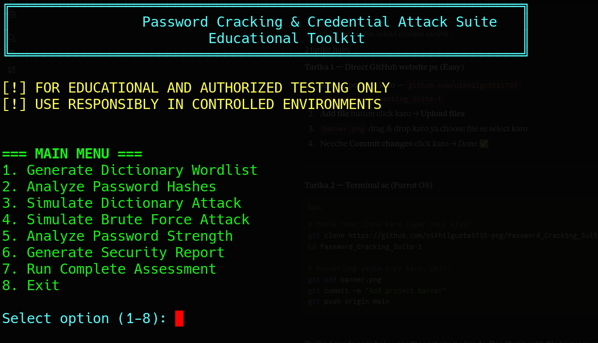

<p align="center">
  
</p>

<p align="center">
  
  
  
  
</p>

---

> ⚠️ **DISCLAIMER:** This tool is built strictly for **educational purposes** and **authorized security testing** in controlled environments. Unauthorized use against systems you do not own is **illegal and unethical**. The author assumes no liability for misuse.

---

## 📖 Overview

The **Password Cracking & Credential Attack Suite** is a feature-rich Python program that simulates real-world password attack techniques used in penetration testing and security audits. It helps you understand how weak passwords can be cracked — so you can build stronger defenses.

---

## ✨ Features

| Module | Description |
|--------|-------------|
| 🗂️ **Dictionary Generator** | Generate custom wordlists with name-date combos, leet speak mutations, keyboard patterns, and common passwords |
| 🔍 **Hash Analyzer** | Identify hash types (MD5, SHA-1, SHA-256, etc.) and parse Linux shadow file entries |
| 💥 **Dictionary Attack Simulator** | Simulate dictionary-based cracking against a target hash |
| 🔨 **Brute Force Simulator** | Simulate brute force attacks up to 4-character passwords with charset selection |
| 📊 **Password Strength Analyzer** | Calculate entropy, detect patterns, check complexity requirements, and flag common passwords |
| 📄 **Report Generator** | Auto-generate security audit reports in TXT, JSON, and CSV formats |
| 🧪 **Complete Assessment Mode** | Run a full end-to-end security assessment in one command |

---

## 📁 Project Structure

```
Password_Cracking_Suite-1/
├── password_cracking_suite-1.py   # Main script (all modules included)
├── banner.png                     # Project banner
└── README.md                      # Project documentation
```

---

## 🚀 Getting Started

### Prerequisites

- Python 3.8 or above
- No external dependencies — uses only Python standard library (`hashlib`, `itertools`, `string`, `re`, `json`, `csv`, `argparse`)

### Installation

```bash
git clone https://github.com/nikhilgupta1735-png/Password_Cracking_Suite-1.git
cd Password_Cracking_Suite-1
```

### Running the Tool

```bash
# Interactive Mode
python3 password_cracking_suite-1.py

# Demo Assessment (auto runs everything)
python3 password_cracking_suite-1.py --demo

# Help
python3 password_cracking_suite-1.py --help
```

---

## 🛠️ Module Breakdown

### 1. 🗂️ Dictionary Generator

Generates a comprehensive wordlist combining common passwords, keyboard patterns, name-date combos, leet speak mutations, and number/special char suffixes.


### 2. 🔍 Hash Analyzer

Identifies hash type by hex length (MD5, SHA-1, SHA-256, SHA-512, etc.), parses Linux `/etc/shadow` entries, and generates demo hashes for testing.

---

### 3. 💥 Dictionary Attack Simulator

Runs a wordlist against a target hash (MD5 / SHA-256 / SHA-512). Reports password found, attempt count, and time elapsed.

---

### 4. 🔨 Brute Force Simulator

Iterates all character combinations up to 4 characters. Charset options: `lower`, `upper`, `digits`, `all`. Shows estimated crack time before starting.

---

### 5. 📊 Password Strength Analyzer

Evaluates entropy, strength rating, complexity score (0–5), pattern detection (sequences, years, keyboard walks), and flags common passwords.

---

### 6. 📄 Report Generator

Generates three report formats: `.txt` (human-readable), `.json` (structured), `.csv` (spreadsheet-ready).

---

### 7. 🧪 Complete Assessment

Runs all 6 steps automatically: wordlist generation → hash creation → strength analysis → attack simulation → time estimation → report generation.

---

## 🖥️ Interactive Menu

```
=== MAIN MENU ===
1. Generate Dictionary Wordlist
2. Analyze Password Hashes
3. Simulate Dictionary Attack
4. Simulate Brute Force Attack
5. Analyze Password Strength
6. Generate Security Report
7. Run Complete Assessment
8. Exit
```

---

## 📸 Sample Output

```
[*] Starting dictionary attack simulation...
[*] Tested 0 passwords...
[+] Password cracked: password123
Attempts: 47
Time elapsed: 0.02 seconds

Analysis Results:
Password: ***********
Length: 11
Entropy: 52.14 bits
Strength: Fair
Complexity Score: 3/5

Requirements:
  ✓ Length
  ✗ Uppercase
  ✓ Lowercase
  ✓ Digits
  ✗ Special Chars

Detected Patterns:
  • Sequential characters: 123
  • Common pattern: 123
```

---

## 🔐 Supported Hash Algorithms

| Hash | Length (hex chars) |
|------|--------------------|
| MD5 | 32 |
| SHA-1 | 40 |
| SHA-224 | 56 |
| SHA-256 | 64 |
| SHA-384 | 96 |
| SHA-512 | 128 |

---

## 🎯 Use Cases

- Learning how password attacks work in a safe lab environment
- Wordlist generation for CTF challenges
- Understanding password entropy and strength scoring
- SOC analyst training and awareness exercises

---

## 🧑‍💻 Author

**Nikhil Gupta**  
Aspiring Cybersecurity Professional | SOC Analyst | Penetration Tester  
GitHub: [@nikhilgupta1735-png](https://github.com/nikhilgupta1735-png)

---

## 📜 License

MIT License — free to use and modify for educational purposes.

---

## 🤝 Contributing

Pull requests are welcome! Open an issue or PR for new features like rainbow table simulation, NTLM cracking, or rule-based mutations.

---

*Built for learning. Use ethically. Stay curious.* 🛡️
